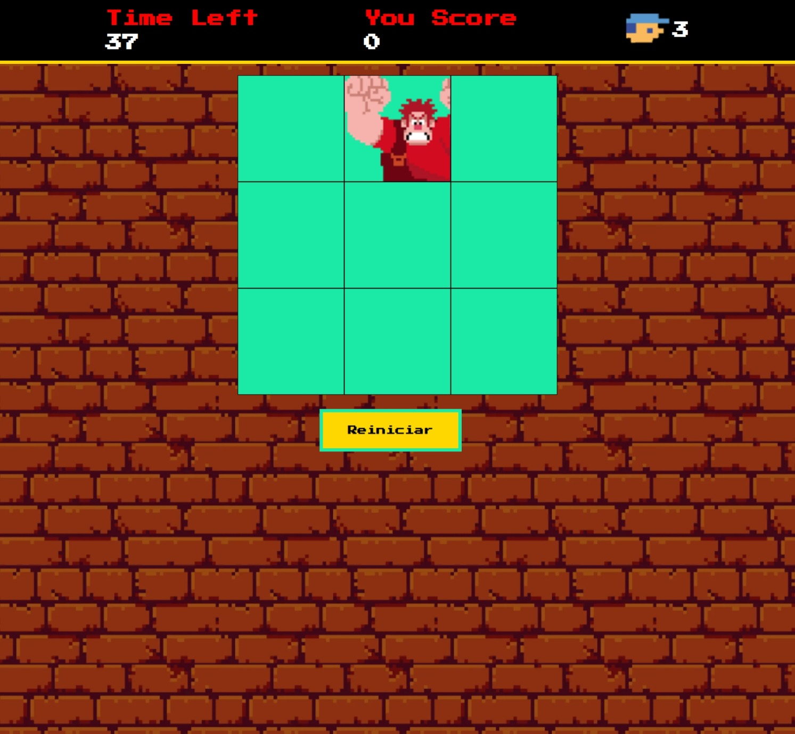

# Jogo "Detona Ralph" - Projeto DIO

## 🎮 Descrição
Este projeto é inspirado no filme "Detona Ralph" e foi desenvolvido como parte de um desafio da plataforma DIO (Digital Innovation One). O objetivo do jogo é simples e divertido: acertar o Ralph toda vez que ele aparecer em uma janela. O jogo foi construído com HTML, CSS e JavaScript, utilizando lógica de JavaScript para movimentar o personagem e tornar a experiência interativa.

## 💻 Tecnologias Utilizadas

HTML5: para estruturar o conteúdo e criar o layout do jogo.
CSS3: para estilizar os elementos e proporcionar uma experiência visual agradável.
JavaScript: para implementar a lógica do jogo, como o movimento do personagem e o controle de pontuação.

## ⚙️ Funcionalidades

Personagem dinâmico: Ralph aparece aleatoriamente em janelas diferentes, trazendo um desafio de reflexo e agilidade.
Sistema de Pontuação: Cada vez que o jogador acerta o Ralph, a pontuação é atualizada.
Design responsivo: O jogo foi pensado para se adaptar a diferentes tamanhos de tela, garantindo uma experiência imersiva tanto em desktop quanto em dispositivos móveis.

## 🔗 Demo do Jogo

## 📸 Screenshots

## 📈 Próximos Passos

Melhorias na movimentação do personagem
Adição de níveis de dificuldade
Implementação de um ranking de pontuação para os melhores jogadores

## 👩‍💻 Contribuição
Sinta-se à vontade para contribuir com sugestões ou melhorias. Basta fazer um fork do projeto, implementar as mudanças e enviar um pull request.
